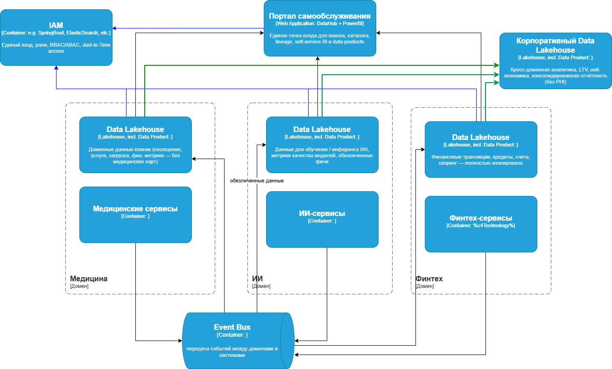

# Задание 1. Проектирование целевой архитектуры и приоритизация проблем для поддержки ключевых бизнес-сценариев компании

## Ключевые бизнес-цели и сценарии

**O1. Быстрая подготовка отчётности**  
Сократить время формирования большинства управленческих, операционных и финансовых отчётов с часов до минут, внедрив портал самообслуживания, где бизнес-пользователи могут самостоятельно строить нужные срезы данных в пределах своего уровня доступа.

**O2. Независимое развитие доменов**  
Обеспечить, чтобы каждое бизнес-направление (клиники, ИИ-сервисы, финтех/банк, головной офис, будущие фарма и оборудование) могло развивать свои данные, аналитику и продукты без постоянной блокировки и согласований с центральной командой данных.

**O3. Масштабирование экосистемы**  
Создать такую архитектуру данных и интеграций, при которой подключение нового бизнес-направления, партнёра или приобретённой компании занимает недели, а не месяцы, без необходимости каждый раз перестраивать центральный DWH.

**O4. Безопасность и соответствие регуляторным нормам** Гарантировать физическое и логическое разделение медицинских (особо охраняемых) и финансовых данных, внедрить шифрование, аудит, контроль доступа и механизмы, соответствующие 152-ФЗ, 323-ФЗ, требованиям ЦБ РФ и GDPR (при выходе на международные рынки), минимизировав риски штрафов и отзыва лицензий.

**O5. Выполнить основную миграцию ИТ-ландшафта данных в облако** Перенести основную часть хранилищ данных, аналитических процессов и интеграций в облачную инфраструктуру с обеспечением масштабируемости, отказоустойчивости, геораспределения и существенного снижения затрат на инфраструктуру по сравнению с текущим on-premise решением.

## Проблемные места

| Приоритет | Проблема (кратко) | MoSCoW | Почему именно этот приоритет | Влияние на бизнес-цели |
| --- | --- | --- | --- | --- |
| **1** | Монолитный DWH с зашитой бизнес-логикой | **Must** | Блокирует независимое развитие доменов, подключение новых направлений и быстрый time-to-market | Критично для всех тактических и стратегических целей |
| **2** | Устаревший и неподдерживаемый SQL Server 2008 | **Must** | Высокие риски безопасности, отсутствие современных возможностей, невозможность миграции в облако «как есть» | **О4, О5** |
| **3** | Отсутствие доменной декомпозиции и data ownership | **Must** | Невозможно реализовать независимое развитие направлений и быстрое подключение фармы / оборудования | **О3** |
| **4** | Медленные отчёты и отсутствие самообслуживания | **Must** | Прямо мешает достижению цели по запуску портала самообслуживания в 2026 году | **О1** |
| **5** | Устаревшая интеграционная шина (Camel) как bottleneck и точка отказа | **Should** | Сильно замедляет и усложняет интеграцию новых партнёров и сервисов, но теоретически можно временно обойти | **О1**, не фатально на первом этапе миграции |
| **6** | Нарушение принципов безопасности и разделения медицинских / финансовых данных | **Should** | Высокие регуляторные риски (152-ФЗ, 323-ФЗ, ЦБ), но при правильной миграции можно закрыть параллельно | **О3** |
| **7** | Отсутствие Data Catalog, Lineage, Quality и единого языка данных | **Could** | Усложняет управление и доверие к данным, но не является блокером для запуска портала самообслуживания | **О1, О2, О3** |
| **8** | PowerBuilder как интерфейс операторов клиник | **Could** | Устаревшая технология, но можно мигрировать позже, после стабилизации данных | **О1** |

## Архитектура системы через год

### Ключевые моменты

Новая архитектура — это Data Mesh на базе отдельных lakehouse'ов по доменам + единый governed self-service портал + строгая изоляция regulated-данных, что одновременно даёт бизнесу скорость, автономию, масштабируемость и регуляторную безопасность.

**O1. Быстрая подготовка отчётности**

*   Единый Self-Service Data Portal (DataHub + интегрированный BI-инструмент типа Sigma / Looker)
*   Бизнес-пользователи находят, понимают и анализируют данные за минуты без IT

**O2. Независимое развитие доменов** → **Свой lakehouse на каждый домен** (Медицина, ИИ, Финтех):

*   Полная автономия в выборе технологий, скорости масштабирования и темпе релизов
*   Независимые SLA, вычисления и стоимость
*   Минимальное влияние одного домена на другой при изменениях
*   Упрощённое доказательство регуляторам физического/логического разделения данных

**O3. Масштабирование экосистемы**

*   Децентрализованная модель Data Mesh + Data Products с чёткими Data Contracts
*   Стандартизированный онбординг новых доменов/партнёров за недели (новый lakehouse + шаблон интеграции)

**O4. Безопасность и соответствие регуляторам**

*   Полное разделение медицинских и финансовых данных на уровне инфраструктуры (отдельные аккаунты / tenants)

**O5. Миграция в облако**

*   Cloud-native lakehouse-платформа (Databricks / Snowflake / аналог)
*   Горизонтальное масштабирование, геораспределение, отказоустойчивость
*   Значительное снижение затрат на железо и поддержку

**Ключевые интеграционные принципы**

*   Central Event Bus (Kafka) как основной транспорт для decoupling и real-time
*   Ingestion Layer встроен в коннекторы шины (CDC + batch)
*   Данные попадают в доменные lakehouse'ы через шину

### Диаграмма контейнеров

[Диаграмма в drawio](./diagrams/future_2.0_containers.drawio)  
