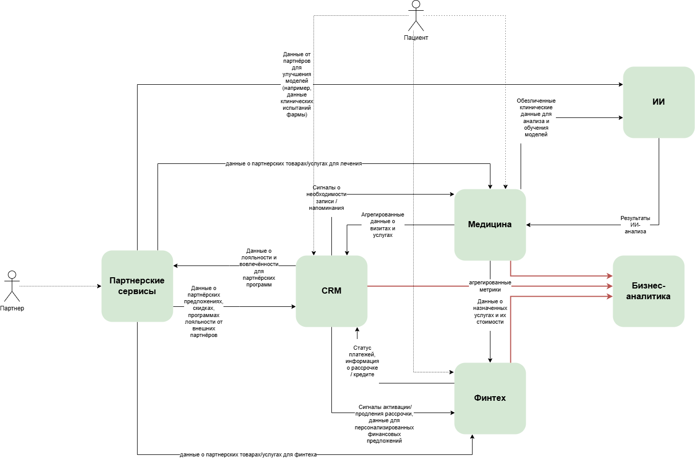

# Задание 2. Разделение системы на домены и моделирование потоков данных для поддержки ключевых бизнес-сценариев

## Список доменов

| № | Домен | Владелец (подразделение) | Основные бизнес-сценарии, которые он закрывает | Почему выделен |
| --- | --- | --- | --- | --- |
| 1 | **Медицина** | Клиники + операционный блок | Запись, приём, лечение, история посещений, загрузка клиник, средний чек, программы лечения, подписки «Здоровье как сервис» | Здесь сосредоточена вся операционная медицинская активность. Любое изменение в лечении или услугах не должно затрагивать банк или ИИ. |
| 2 | **ИИ диагностика** | Компания ИИ-сервисов | ИИ-диагностика, предиктивная аналитика рисков, контроль приверженности лечению, качество моделей | ИИ — это отдельный продукт, который может продаваться white-label другим клиникам. Ему нужны свои модели, feature store и высоконагруженный ML-кластер. |
| 3 | **Финтех** | Финтех + Банк | Рассрочка, кредиты на лечение, платежи, скоринг, банковские продукты, кэшбэк, страхование здоровья | Регуляторно самый тяжёлый домен (ЦБ, 115-ФЗ, банковская лицензия). Требует полной изоляции от медицинских данных. |
| 4 | **CRM** | Отдел продаж, либо Головной офис | Управление полным жизненным циклом клиента, управление подписочными моделями, персонализированные предложения, кросс-продажи внутри экосистемы, снижение оттока | С учетом планов компании по развитию и интеграции различных бизнесов в экосистему, компаниии необходимо выделение этого домена. Сейчас вся информация лежит в едином хранилище, а при разделении на домены будет размазана между доменами Финтех и Медицина. |
| 4 | **Партнерская экосистема** | Новое подразделение (или под головным офисом) | Интеграции с фармой, производителями медоборудования, страховыми, корпоративными клиентами, white-label ИИ | Здесь будут появляться новые партнёры. Выделение позволяет подключать фарму или оборудование за 3–6 недель, а не 6–9 месяцев. |
| 5 | **Корпоративная аналитика** | Головной офис | Консолидированная отчётность, Единый клиентский путь, LTV, unit-экономика, глобальные KPI, дашборды топ-менеджмента, регуляторная отчётность | Домен, который хранит агрегированные данные из всех доменов, но он не хранит сырые медицинские и финансовые данные. Нужен для целостной картины бизнеса. |

## Потоки данных

В диаграмме не описываются все процессы компании и потоки данных.
Считаем, что каждый домен представляет собой один крупный процесс (например, домен **Медицина** обеспечивает процесс *оказания медицинских услуг*) и инкапсулирует в себе хранилище своих данных.
Поэтому диаграмма отличается от стандартного представления DFD и отображает потоки данных между доменами.

[Диаграмма потоков данных в drawio](./diagrams/DFD.drawio)
