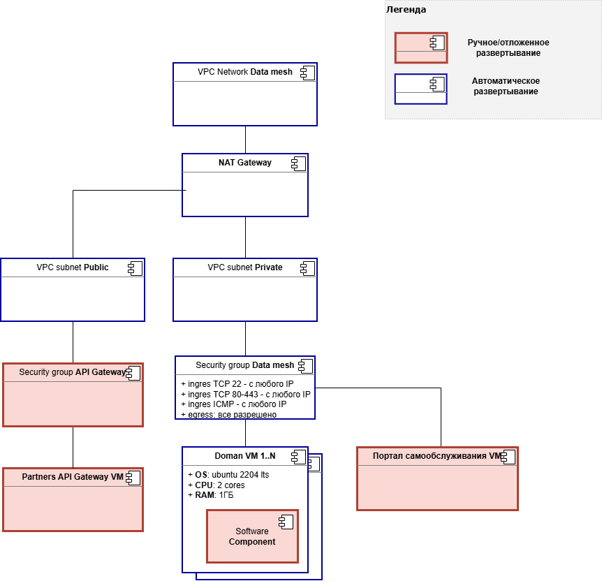
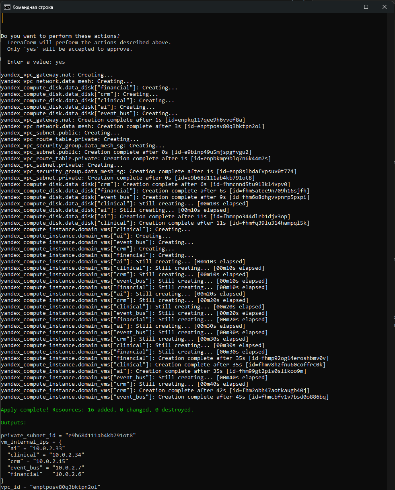

# Задание 4. Проектирование облачной инфраструктуры с применением IaaS и Terraform

## Диаграмма развертывания

[Диаграмма развертывания в drawio](./img/deployment.drawio)  

## Обоснование плана развертывания

[Обоснование конфигурации](./justification.md)

## Применение настроек terraform

